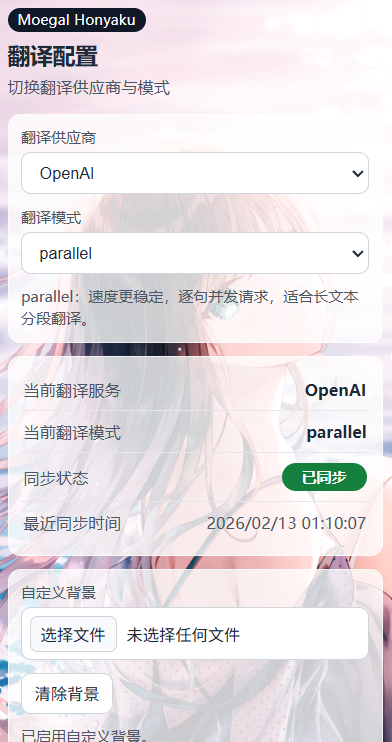

# Moegal Honyaku FE

一个给网页漫画图一键翻译的浏览器插件。

## 这个插件能做什么

- 鼠标放到图片上，点“翻译图片”
- 在插件里切换翻译模式
- 给插件弹窗换背景图

## 使用前准备

1. 先把 Moegal Honyaku 后端程序打开（不打开就无法翻译）。
2. 浏览器建议使用 Chrome 或 Edge。

## 第一次安装（3 步）

1. 打开 `chrome://extensions`。
2. 打开右上角“开发者模式”。
3. 点“加载已解压的扩展程序”，选择当前项目文件夹。

## 平时怎么用

1. 打开你要看的网页。
2. 把鼠标移到漫画图上。
3. 点击“翻译图片”，等待几秒即可。
4. 如果要改设置，点击浏览器右上角的插件图标。

## 常见问题

- 提示翻译失败：先确认后端程序还在运行。
