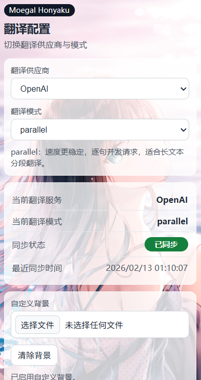

# Moegal Honyaku FE

一个给网页漫画图一键翻译的浏览器插件。

## 这个插件能做什么

- 鼠标放到图片上，点“翻译图片”
- 翻译完成后自动显示译图，可用同一个悬浮按钮在原图和译图之间反复切换
- 在插件里切换翻译模式、文字方向和 CPU/GPU 计算设备
- 给插件弹窗换背景图

背景图会在裁剪后自动压缩为适合扩展存储的 WebP，并保存到 `chrome.storage.local`；旧版本保存在 `localStorage` 的背景会自动迁移。

## 使用前准备

1. 先把 Moegal Honyaku 后端程序打开（不打开就无法翻译）。
2. 浏览器建议使用 Chrome 或 Edge。

## 第一次安装（3 步）

1. 打开 `chrome://extensions`。
2. 打开右上角“开发者模式”。
3. 点“加载已解压的扩展程序”，选择当前项目文件夹。

## 平时怎么用

1. 打开你要看的网页。
2. 把鼠标移到漫画图上。
3. 点击“翻译图片”，等待几秒即可。
4. 翻译完成后，悬浮按钮会变成“查看原图”；切换后会显示“查看译图”，可不限次数切换且不会重复请求翻译。
5. 如果要改设置，点击浏览器右上角的插件图标。
6. 在 popup 里可把文字方向切到横排或竖排，也可选择 OCR 使用 CPU 或 GPU。

## 常见问题

- 提示翻译失败：先确认后端程序还在运行。
- 选择 GPU 后仍显示 CPU：当前 CUDA 环境不可用，后端已自动回退到 CPU。
- 背景图保存失败：插件会自动压缩大图；若仍失败，请检查浏览器是否限制了扩展存储空间，或换一张图片重试。
